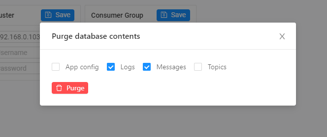
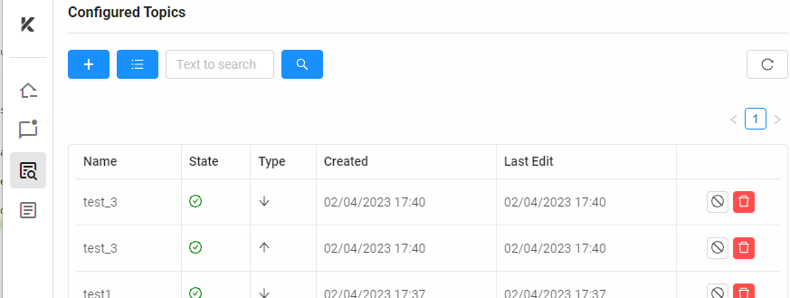

<h1  align="center" style="border-bottom: none">
    <b>
        Kafka Explorer
    </b>
</h1>
    <h4 align="center">An open-source tool to test Kafka consumers and producers</h4>
 

 

 

## Built Using

- [VueJS](https://vuejs.org/)
- [Electron](https://www.electronjs.org/)
- [KafkaJS](https://kafka.js.org/)
- [NeDB Promise](https://github.com/bajankristof/nedb-promises)
- [Vuetify](https://vuetifyjs.com/en/)
- [Antd Vue](https://www.antdv.com/docs/vue/introduce/)

 

## How to build ?

* Download this repository to your machine.
* Move to the directory and type `npm i` to install all the node dependencies.
* Run the dev environment, use `npm run electron:serve`
* To build the app for Windows environment(Executable), use the command `npm run win-build`

## How to use ?

1. For the very first time you need to configure the app with the botstrap server(s) URL, username and password. You can also set the consumer group to be used.

Once the app sucessfully connects with the broker/cluster the bottom bar will show the controller URL and also the status (green)

> The bottom bar also diplays the total size of the embedded database. It also lets you delete data from the database. You can do so by clicking on the purge button. Yu can select which type of data you want to remove as well.

2. In the home page you can  you can add topic to subscribe to and topic yu want to publish to.

The messages are shown in red if they are published or received over 5 mins ago, otherwise all the latest messages will be in green. 
In the publish message side you can select the topic you want to publish to or you can add a new one as well.
In consumed side you can adda new topic to listen to. Once added the app will listen to all the topics by default.
> If you want to remove a topic, either from subscribe or publish list, you can do so from the `Topics` menu. The page shows all the topics the app is configured with. You can also see all the avilable topics in the connected cluster in this page.

to be continued.....

## License

Distributed under the AGPLv3 License. See `LICENSE.md` for more information.

 