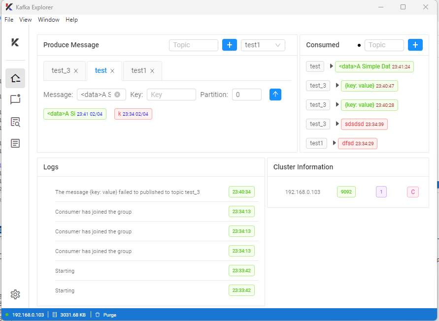

<h1  align="center" style="border-bottom: none">
    <b>
        Kafka Explorer
    </b>
</h1>
    <h4 align="center">An open-source tool to test Kafka consumers and producers</h4>
<br/>
<p align="center">


</p>
<br/>
<p align="center"></p>
<br/>

## Built Using

- [VueJS](https://vuejs.org/)
- [Electron](https://www.electronjs.org/)
- [KafkaJS](https://kafka.js.org/)
- [NeDB Promise](https://github.com/bajankristof/nedb-promises)
- [Vuetify](https://vuetifyjs.com/en/)
- [Antd Vue](https://www.antdv.com/docs/vue/introduce/)

<br/>

## License

Distributed under the AGPLv3 License. See `LICENSE.md` for more information.

<br/>

### Useful Kafka Commands

<br/>

```sh
cd C:\kafka\zookeeper
.\apache-zookeeper-3.7.0-bin\bin\zkServer.cmd

cd  C:\kafka\kafka
.\bin\windows\kafka-server-start.bat .\config\server.properties

cd  C:\kafka\kafka\bin\windows
.\kafka-console-producer.bat --broker-list localhost:9092 --topic test2

cd C:\kafka\kafka\bin\windows
.\kafka-console-consumer.bat --bootstrap-server localhost:9092 --topic test2
```
