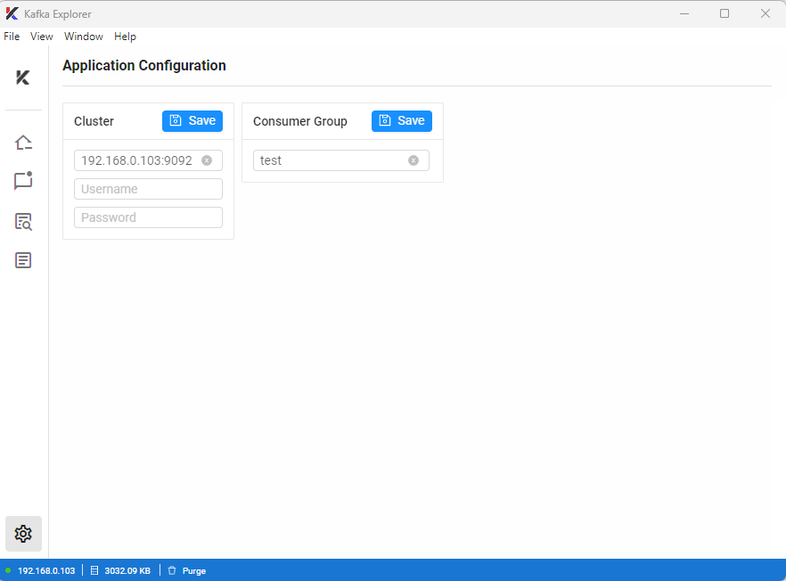

# kafka-explorer

[](https://sonarcloud.io/summary/new_code?id=WGLabz_kafka-explorer) [](https://sonarcloud.io/summary/new_code?id=WGLabz_kafka-explorer) [](https://sonarcloud.io/summary/new_code?id=WGLabz_kafka-explorer) [](https://sonarcloud.io/summary/new_code?id=WGLabz_kafka-explorer)

## APP Screenshots

<table style="border: 0px;">
    <tr style="border: 0px;">
        <td style="border: 0px;">
            
        </td>
        <td style="border: 0px;">
            
        </td>
    </tr>
    <tr style="border: 0px;">
        <td style="border: 0px;">
            
        </td>
        <td style="border: 0px;">
            
        </td>
    </tr>
</table>

### Useful Kafka Commands

>

```sh
cd C:\kafka\zookeeper
.\apache-zookeeper-3.7.0-bin\bin\zkServer.cmd

cd  C:\kafka\kafka
.\bin\windows\kafka-server-start.bat .\config\server.properties

cd  C:\kafka\kafka\bin\windows
.\kafka-console-producer.bat --broker-list localhost:9092 --topic test2

cd C:\kafka\kafka\bin\windows
.\kafka-console-consumer.bat --bootstrap-server localhost:9092 --topic test2
```
